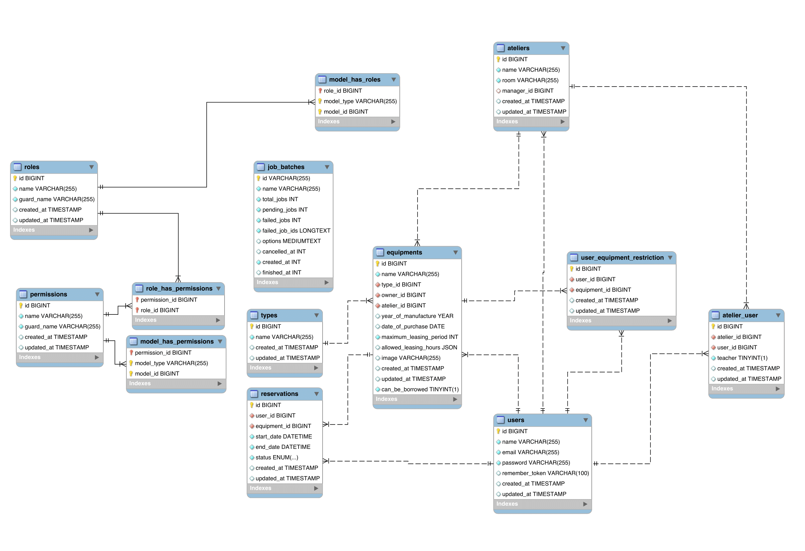

# Umělecká škola

### Autoři
- **Marek Tenora**  
  [xtenor02@stud.fit.vutbr.cz](mailto:xtenor02@stud.fit.vutbr.cz) - Správa profilu, rezervace a spravování rezervací, komponenta tabulky. Vytvoření generování seedů a naplnění databáze. Nasazení na server, výběr a instalace technologií. Video.
  
- **Natália Sobihardová**  
  [xsobih00@stud.fit.vutbr.cz](mailto:xsobih00@stud.fit.vutbr.cz) - Tabulka typů, Detail ateliéru a jeho funkce, vytváření rezervací, přehled uživatelových rezervací, dokumentace.

- **Petr Štancl**  
  [xstanc12@stud.fit.vutbr.cz](mailto:xstanc12@stud.fit.vutbr.cz) - Tabulka uživatelů a zařízení. Vytváření ateliérů, zařízení, typů. Editační dialogy. Logika rolí a povolení. Blokace uživatele na konkrétní zařízení, blokace zařízení celkově.

### URL aplikace
[https://iis.olivebranch.cz/](https://iis.olivebranch.cz/)

---

## Uživatelé systému pro testování

Uveďte prosím existující zástupce **všech rolí uživatelů**.

| Login              | Heslo | Role                                                                                                                                          |
|--------------------|-------|------------------------------------------------------------------------------------------------------------------------------------------------|
| admin@IIS.com      | admin | Administrátor                                                                                                                                  |
| user@IIS.com       | user  | Uživatel                                                                                                                                       |
| manager@IIS.com    | manager | Správce ateliéru (základně má roli uživatele, ale jakmile jej nastavíte u ateliéru správcem, získá vyšší práva)                             |
| teacher@IIS.com    | teacher | Učitel v ateliéru (základně má roli uživatele, ale jakmile jej nastavíte v nějakém ateliéru učitelem, získá vyšší práva)                      |

---

### Video
[Odkaz na video](https://drive.google.com/file/d/1j5lB6PU3VJhMWzh38dpSDpw9TU8SDb7D/view?usp=sharing)

---

## Implementace
- **AtelierController.php** - view na ateliéry. Zobrazení přehledu a detailu ateliérů, editace ateliéru, tvorba ateliéru, smazání ateliéru, přidání/odebrání uživatele do ateliéru, přidání/odebrání učitele do ateliéru.  
- **EquipmentController.php** - view na zařízení. Zobrazení přehledu zařízení, editace zařízení, tvorba zařízení, smazání zařízení.  
- **MyReservationController.php** - view na uživatelovi rezervace. Zobrazení uživatelových rezervací a jejich detail, tvorba rezervací.  
- **ProfileController.php** - view na správu profilu uživatele. Změna údajů, změna hesla, smazání účtu.  
- **ReservationController.php** - view na správu příchozích rezervací. Zobrazení přehledu a detailu příchozích rezervací, změna stavu rezervace.  
- **TypeController.php** - view na typy zařízení. Zobrazení přehledu typů, editace typu, přidání typu, smazání typu.  
- **UserController.php** - view na uživatele. Zobrazení přehledu uživatelů, editace uživatele, smazání uživatele.  

---

### Přístup podle rolí
- **Uživatel** - Má přístup k stránkám: "My Reservations", "Ateliers".  
- **Učitel** - Má přístup k stránkám: "My Reservations", "Manage Reservations", "Ateliers", "Equipments".  
- **Správce ateliéru** - Má přístup k stránkám: "My Reservations", "Ateliers", "Types".  
- **Administrátor** - Má přístup k stránkám: "My Reservations", "Manage Reservation", "Ateliers", "Types", "Equipments".

---

### Databáze


---

## Instalace

Stručně popište:
- Pro rozjetí aplikace je potřeba mít **php 8.2 >= s knihovnou 'composer', node.js s modulem 'npm' a MySQL databázi.**
- **Instalace**:
  1) Instalace dependencí:
      ```
      php composer install
      npm install
      ```
  2) Vytvoření databáze:
      ```
      K tvorbě databáze je potřeba v MySQL provést jediný příkaz a to "CREATE DATABASE iis;". Poté se pomocí příkazu "php artisan migrate:fresh --seed" vytvoří tabulky a naplní se ukázkovými datami.
      ```
  3) Nastavení `.env`:
      ```
      Přejmenovat .env.example na .env a nastavit dle potřeb. Hlavní je nastavení APP_KEY, který je možné vygenerovat pomocí "php artisan key:generate". Dále je zde potřeba napojit databázi dle předlohy. Více info o .env je možné najít [zde](https://laravel.com/docs/11.x/configuration).
      ```
  4) Spuštění serveru:
      ```
      npm run build
      php artisan serve
      ```

---

## Známé problémy

- Nepoužití dynamického načítání dat z backendu může v případě většího naplnění databáze výrazně zpomalit aplikaci.
- Optimalizace UI pro mobilní zařízení a pro lepší orientaci v aplikaci.